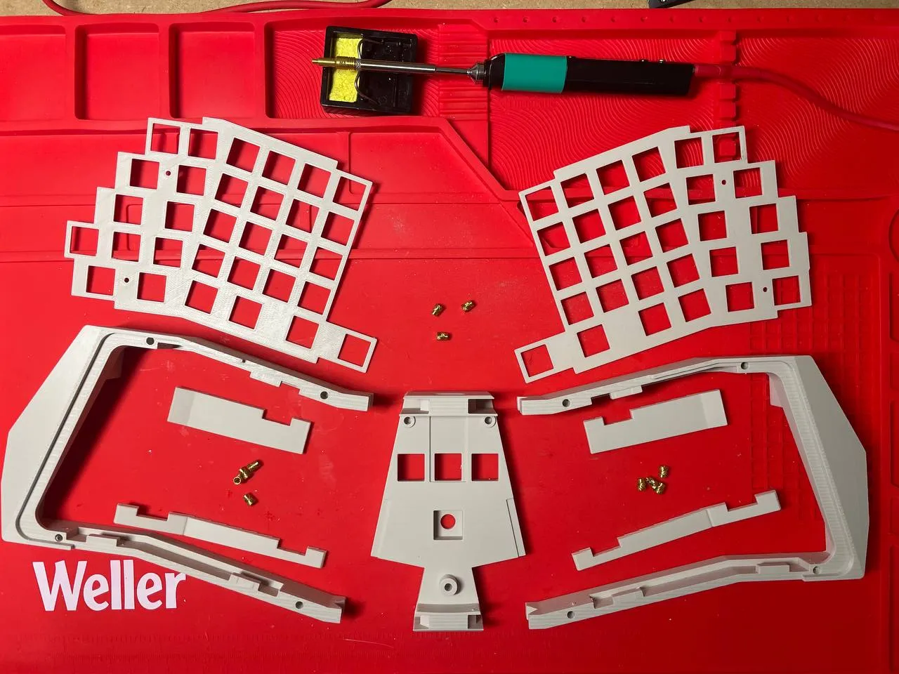
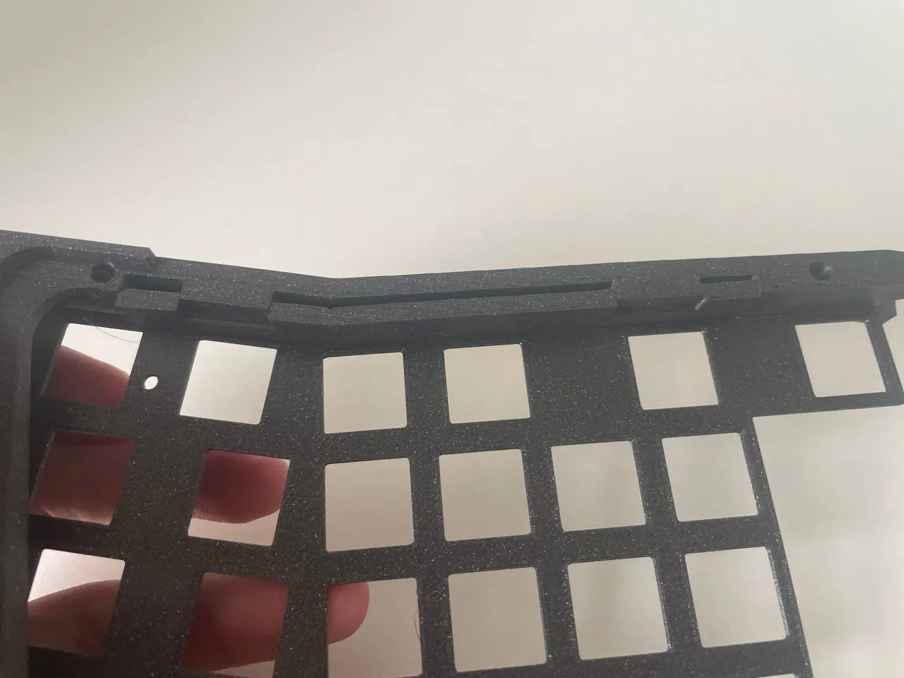
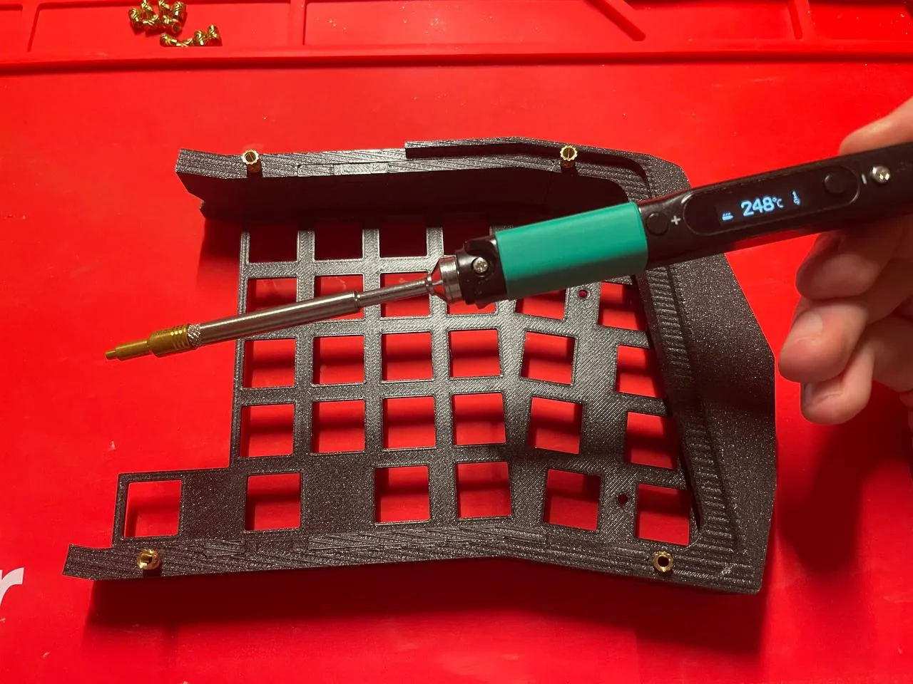
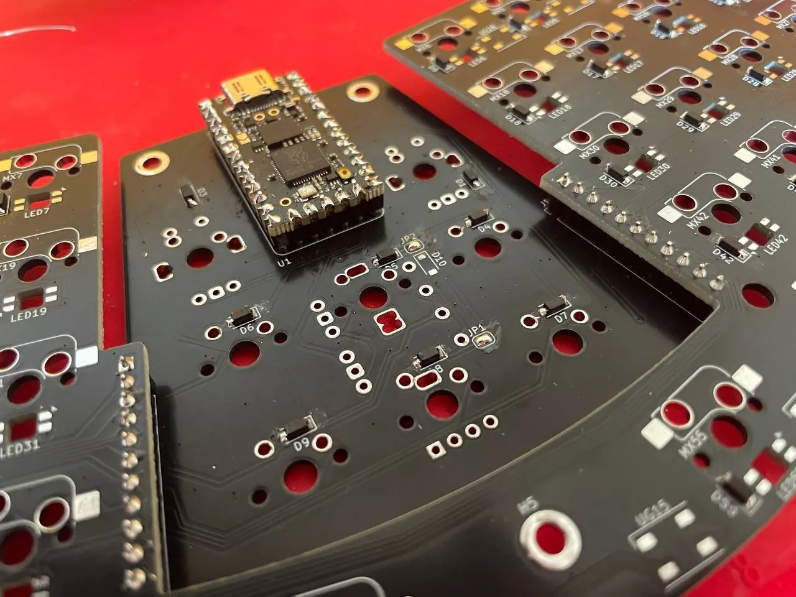
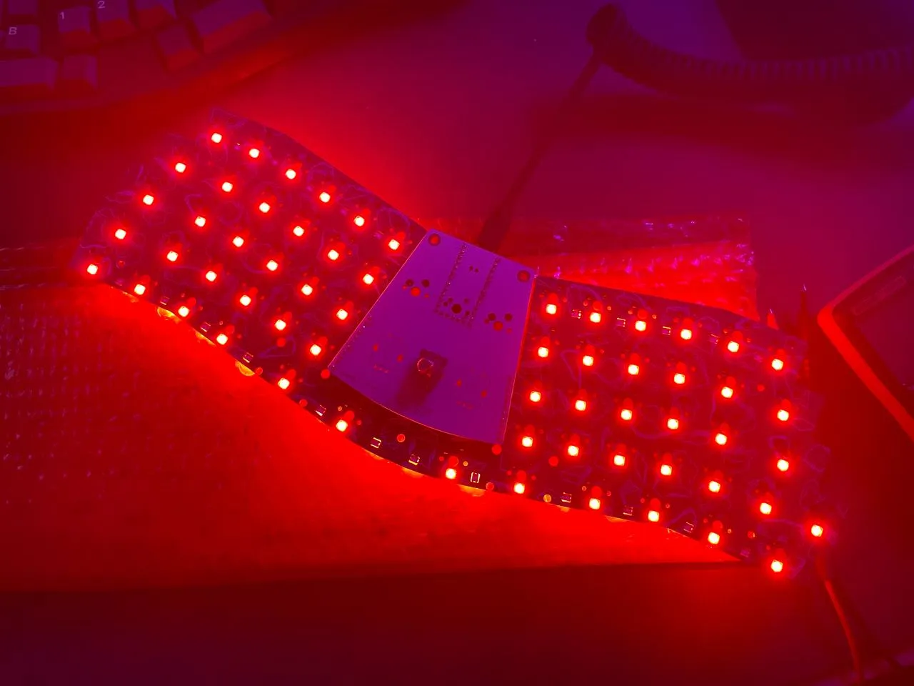
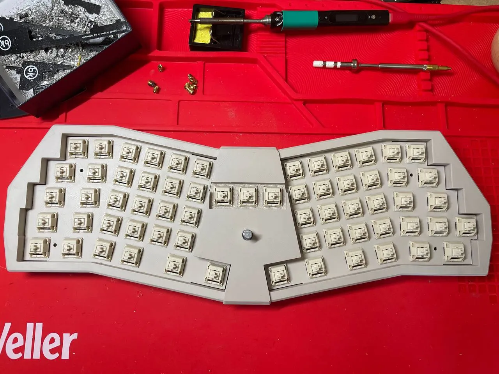

# build guide

## bom

### shell pcb

- [ ] shell pcb
- [ ] 61 kailh mx hot swap sockets
- [ ] 61 smd diodes (1N4148W)
- [ ] 2x single row 11 pin 2.54mm female pin header (the cheap ones you can get from eBay / AliExpress)
- [ ] silver wire or diode legs for the pin header

> [!WARNING]
> Be aware that if you don't use the hot swappable headers to connect the pcbs the core pcb will sit slightly lower. You'll have to adjust the core case.

optional:
- [ ] underglow: 22x SMD RGB leds (SK6812MINI-E)
- [ ] per key: 61x RGB leds (SK6812MINI-E), underglow leds are required
- [ ] 2x stabilizer

> [!NOTE]  
> The pcb has holes for stabilizers but the plate does not as I use mine without stabilizers. This works great with switches with good tolerances like Gateron.

### core pcb

- [ ] core pcb
- [ ] 1x [0xCB Helios](https://keeb.supply/products/0xcb-helios) controller
- [ ] single row 2.54mm female pin header for the controller (the cheap ones you can get from eBay / AliExpress)
- [ ] silver wire or diode legs for the pin header

Depending on your core pcb you might need additional headers, hot swap sockets or hardware but that should be straight forward

> [!TIP]
> I highly recommend mill-max hot swap sockets for the switch thats directly on the controller footprint. I used 3305 but there should be enough space with the hot swappable pin header for the other socket types from mill-max.

### 3dp case

- [ ] 11x [M3 x 5.7 heat set inserts](https://cnckitchen.store/products/heat-set-insert-m3-x-5-7-100-pieces)
- [ ] 8x M3 5-8mm screws (visible from the bottom)
- [ ] 3x M3 5mm screws (on the inside)
- [ ] 3d printed parts: both shell pieces, both plates, all four plate fixers, core piece
- [ ] 3mm acrylic bottom plate
- [ ] 6x 8mm rubber feet

### additional hardware depending on layout

encoder core

- [ ] 2 kailh mx hot swap sockets
- [ ] 1 smd diode (1N4148W) per key and encoder
- [ ] encoder (2 at most)
    - ec11 rotary encoder with a short (d) shaft (15mm)
    - knob

versatile core

- [ ] 1 smd diode (1N4148W) per key and encoder
- [ ] encoder (2 at most)
    - ec11 rotary encoder with a short (d) shaft (15mm)
    - knob
- [ ] oled screen
    - 1.3" oled screen
    - pair of single row 4 pin 2.54mm pin headers (the cheap ones you can get from eBay / AliExpress)
    - 4x M2 heat set inserts
    - 4x M2 5mm screws

cute core

- [ ] 4 kailh mx hot swap socket
- [ ] 4 smd diode (1N4148W)

special core

still WIP

## assembly

### preparing the case

1. Insert the left plate in the left shell and fixate it with the fixer pieces. Do the same with the other half. If the fixer pieces don't snug into place nicely you can force them into place with a chopstick and hammer. 
2. Heat up your soldering iron, insert the heat set inserts and gently push them inside the shell pieces as well as the core piece. Make sure to insert them exactly perpendicular so they sit flush with the surface. 

### preparing the shell pcb

1. Start soldering the hot swap sockets, smd diodes and optionally the RGB leds.
2. After that solder the single row headers. Make sure that they go on the opposite side (see markings) and that they are soldered on straight.

### preparing the core pcb

1. If your core supports it and you want to use a switch under the controller please solder the two mill-max sockets under the controller first.
2. Start soldering the single row headers for the controller. Make sure that they are soldered on straight.
3. Align the Helios, insert the silver wire, cut it roughly flush and fixate it with solder. Make sure that you don't heat it up too long so you don't get any solder inside in the pin header. 
4. If you are using RGB leds connect the jumper with the marked or non-marked pad:
    - left jumper pad for the input pin: left (marked) for the Helios' pin 25, right for other controllers (D1)
    - right jumper pad for the power source: left (marked) for raw/5V, right for 3.3V
5. Solder the remaining components specific to the chosen core: kailh hot swap sockets, diodes, encoders or pin headers for an oled screen.
6. Lastly align the core pcb with the shell pcb, insert the silver wire, cut it roughly flush and fixate it with solder. Make sure that you don't heat it up too long so you don't get any solder inside in the pin header. 

### test the pcb

This is important as some components like the outer columns, pin headers and leds on the edge are difficult to reflow later if they are not soldered on properly. 

1. Compile the firmware `make barnacle:default` (<https://github.com/floookay/qmk_firmware/keyboards/barnacle>)
2. Plug in the keyboard, click the reset button on the Helios controller and upload the compiled firmware.
3. Check that all keys and leds work.

### install the pcb

1. Slip on the shell case on the pcb like this: 
2. Add the core case piece and press it downwards: 
3. Screw in the three screws in the middle. 2 on the core pcb, 1 on the shell below.
4. Put in the MX switches. Make sure that the switch legs aren't bent and that they are snapped into the plate. 
5. Screw in the acrylic bottom with the remaining 8 screws.
6. Add the rubber feet to the acrylic plate.
