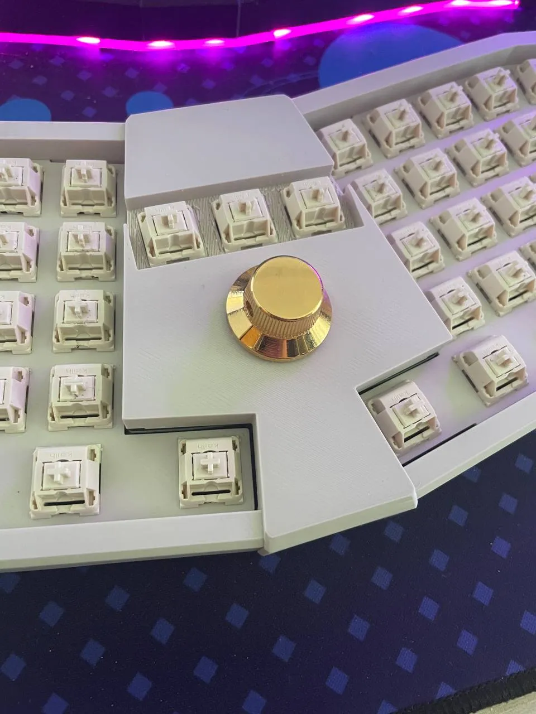

# case

- 3mm acrylic bottom
- 5 degree typing angle
- designed for 3d printing
- sandwich mount
- exchangable core pieces

The case files were designed with FreeCAD 0.21.2

## main

You'll have to split the shell piece into two pieces in the slicer at the groove (the bridge should not be printed). It's not important if the cut removes a little bit of material above the groove. This will be hidden later.

The plate is sandwiched in between the shell and fixer pieces. You can customize the spreadsheet in the FreeCAD file if you are having troubles with the tolerances (it's a tight fit).

## core

### versatile core

This is a great starting point if you want to experiment with different layouts and don't care too much about hot swap ability.

The following configurations are supported:
- 9 keys
- 3 keys and a encoder with a big knob
- 3 keys and a 0.96"/1.3" OLED screen
- 2 small encoders, 1 key and a 0.96" OLED screen
- a central encoder with the biggest knob

I added a couple of printable cores possible with the versatile core pcb but to get

### encoder core

This core has three top keys and a encoder beneath like the versatile core but with hot swap sockets. Alternatively you can install an encoder on the left and a second one on the right.

### special core

This core is intended for fun stuff like a trackball or similiar but I haven't worked on that yet.

### cute core

This is just a simple core with 4 centered keys with hot swap.

> [!TIP]
> You can add text or graphics in the slicer

### wood core

This core is also a work in progress. The plan is to add a wooden window piece.

## printer settings

- 0.4mm nozzle
- 0.2mm layer height
