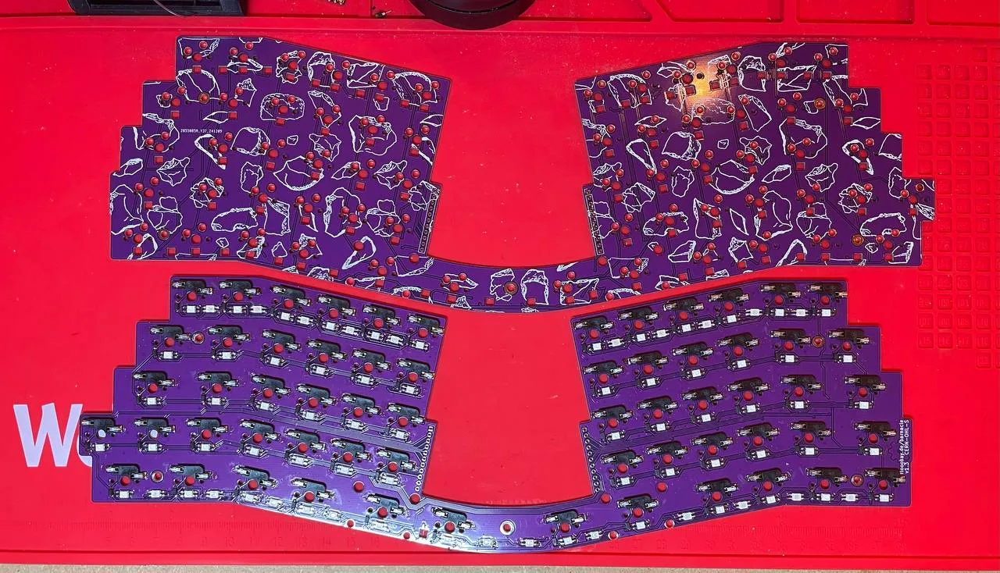
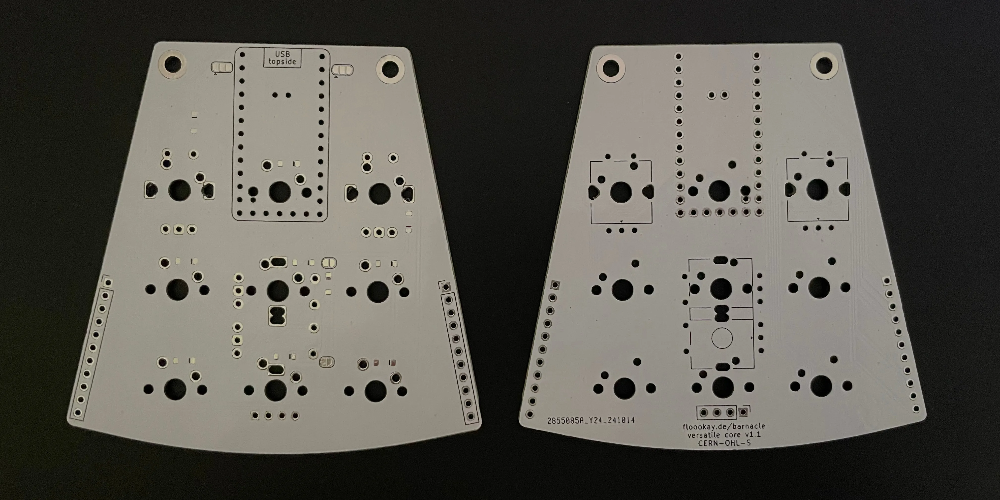
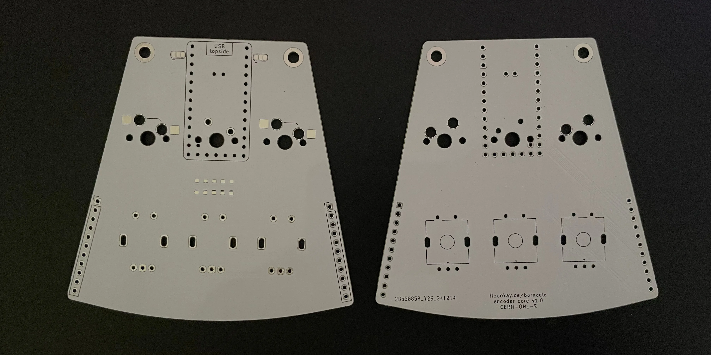
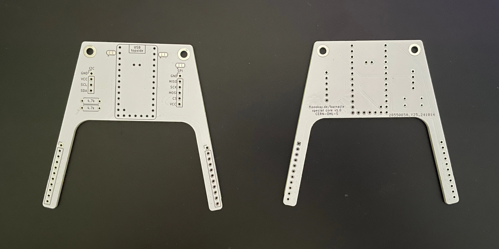
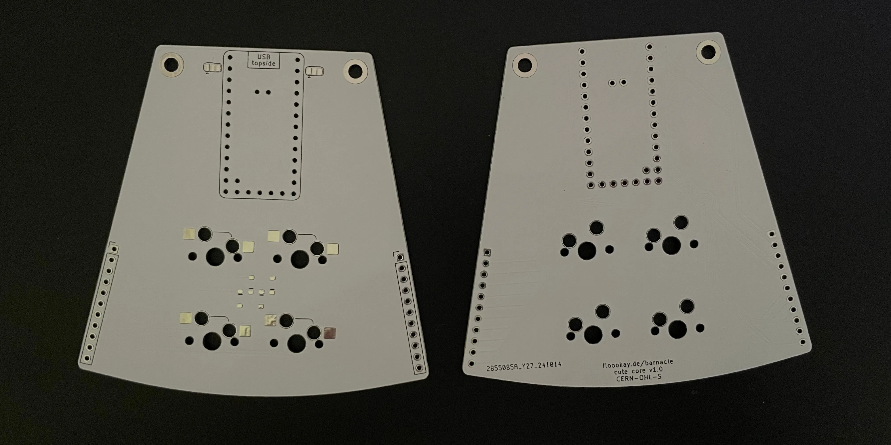

# pcb

## shell pcb

The shell has a fixed layout with hotswap sockets as well as RGB underglow und per key RBG leds (**per key is not tested yet**).

## core pcb

You can use any core pcb with a shell. They are smaller than 100mmx100mm so it's relativly cheap to get a small batch made.

> [!NOTE]
> Every core has two jumpers at the top next to the controller. If you want to use RGB leds you will have to bridge either the left or right pads each.
> - Left jumper pad for the input pin: left (marked) for the Helios' pin 25, right for other controllers (D1)
> - Right jumper pad for the power source: left (marked) for raw/5V, right for 3.3V

### versatile core

This is a great starting point if you want to experiment with different layouts and don't care too much about hot swap ability.

The following configurations are supported:
- 9 keys
- 3 keys and a encoder with a big knob
- 3 keys and a 0.96"/1.3" OLED screen
- 2 small encoders, 1 key and a 0.96" OLED screen
- a central encoder with the biggest knob

> [!NOTE]
> There are two additional jumpers on this pcb. These are used so the GND pad of the encoder isn't connected to a column. If you want to use the adjacent key you'll have to close it.

### encoder core

This core has three top keys and a encoder beneath like the versatile core but with hot swap sockets.

### special core

This core exposes I2C and SPI pins and has a large cutout for mounting a trackball, trackpad or large oled to the core case (WIP).

### cute core

This core has centered 2x2 grid of keys with hot swap sockets.

### _template/ directory

The `_template/` directory contains the basic configuration if you want to create your own core pcb.
