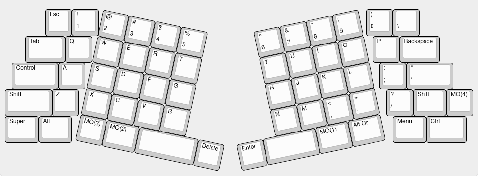

# barnacle

The barnacle is unibody ortho keyboard with an Alice-like split on the pinky columns and a fixed layout that's compatible with keycap base kits.

## inspiration + backstory

The boardrun series was my main inspiration for this project obviously. I desperately wanted to get an acrylic frosted purple boardrun classic but things happend so that's not likely anymore unfortunatelly.

The creativity of designers with colorful keycap designs and interesting keyboards (like the TGR Alice) got me hooked with the hobby. I exclusively switched to non-rowstagger keyboards a couple of years ago and realized that I own a lot of beautiful keycaps that I love but can't use because of these weird non-symmetrical larger-than-1.5u mod key sizes per row. Most ergonomic keyboard designs that are trying to solve that issue, I don't find aesthetically pleasing or don't like the layout.  
So I've set out to create my own: the barnacle

## design goals

- 5x6 unibody ortho keyboard
- base kit compatibility
- 3d printable on 220mm build plates
- symmetric design (AMAP)
- outer thumb keys next to space bars
- easily expandable later on
- minimize stabilizer use

## layout

The main layout is fixed but the different cores offer some variety. This is based on my Sol keymap but you can modify it in QMK of course.

layout

The layout is pretty much compatible with every base kit. These are the keys you could look out for beforehand as they are sometimes missing:
- a second R3 1.75u key (capslock/control)
- if ISO is omitted and the bottom row is another profile than the row above: a 1.25u shift key. If they are the same profile you can use the 7th 1.25u mod key
- 2u and 2.25u space bars, alternativly you can use shift keys

Some 40s kits have accent colored R3 1.75u keys so thats something you could look out for if you like accent keys.

## pcb

The barnacle uses a two part pcb design that are connected via hotswap sockets:  
- shell pcb
- core pcb in different variations

It uses the [0xCB Helios](https://keeb.supply/products/0xcb-helios) as its controller. It's an affordable open-source pro-micro-compatible RP2040 controller with ESD protection and additional pins and features.

> [!NOTE]
> See [PCB readme](./pcb/readme.md) for detailed information about the pcbs.

## case

- 3mm acrylic bottom
- 5 degree typing angle
- designed for 3d printing
- sandwich mount
- exchangable core pieces

The case files were designed with FreeCAD 0.21.2

## firmware

This keyboard is powered by QMK: <https://github.com/floookay/qmk_firmware/keyboards/barnacle>

## bom and assembly

For the bill of materials and assembly instructions see [here](./assembly.md).

## ideas and/or stuff I'd like to add in the future

### pcb

- [ ] **bluetooth core** with a nice!nano and without RGB (maybe with a safety cover toggle switch or sth)
- [x] **trackball core** with PMW3360 sensor
- [x] **trackpad core** with a 40mm GlidePoint Cirque Trackpad
- [x] **oled core** with a large (colored?) OLED screen
- [ ] **lumberjack core** with a window and an integrated controller
- [ ] **rgb core** with a window and a rgb matrix
- [ ] **audio core** with a speaker/beeper

### case

- [ ] **brick core** with brick plate on top
- [ ] **wood core** with a cutout wooden window piece
- [ ] **gridfinity core** with a spot for a gridfinity bin
- [ ] **phone core** with a holder for (small) phones, maybe with a magsafe charger
- [ ] **change core** with a tray for coins and stuff
- [ ] **pen core** with a hole that fits a pen

### firmware

- [ ] **ZMK support** with the bluetooth core
- [ ] **vial and/or via support** once merged to main branch

### other

I'd love to do a 40% version at some point but that would be a complete rework. Maybe someday in the future.

## acknowledgements

Huge thank you to ebastler and MarvFPV for the awesome [marbastlib](https://github.com/ebastler/marbastlib) library for KiCAD.

Thanks for reading and feel free to reach out to me or create PRs if you have any questions or things to improve upon.
