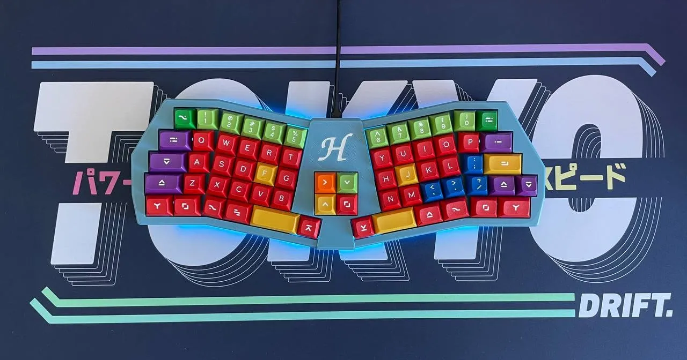

# barnacle

The barnacle is unibody ortho keyboard with an Alice-like split on the pinky columns, a fixed layout that's compatible with keycap base kits and a modular middle piece.

## inspiration

I love the look of the boardrun classic and desperately wanted to get one myself but things happend so that's not likely anymore unfortunately.  
The creativity of designers with colorful keycap designs and interesting keyboard designs got me hooked with the hobby. I bought a bunch of keycap sets over the years that I don't use anymore since I switched to ortho/colstagger keyboards a couple of years ago, because the different asymmetrical key sizes of standard keyboards make it difficult. I don't like the layout or the asthetics of most keyboard designs that are trying to work around this issue. That's why I created the barnacle.

## design goals

- 5x6 unibody ortho keyboard
- base kit compatibility
- 3d printable on 220mm build plates
- symmetric design (amap)
- outer thumb keys next to space bars
- easily expandable later on
- no stabilizers

## layout

The main layout you use to type is fixed but the different cores offer some variety. The default keymap is based on my Sol 3 keymap but you can modify it in QMK of course.

The base layout is pretty much compatible with every base kit. These are the keys you could look out for beforehand as they are sometimes missing:
- a second R3 1.75u key (capslock/control)
- if ISO is omitted and the bottom row is another profile than the row above: a 1.25u shift key. If they are the same profile you can use the 7th 1.25u mod key
- 2u and 2.25u space bars, alternativly you can use shift keys

> [!TIP]
> Some 40s kits have accent colored R3 1.75u enter keys so thats something you could look out for if you like accent keys.

## pcb

The barnacle uses a two part pcb design which are connected via hotswap sockets:  
- shell pcb
- core pcb in different variations

It uses the [0xCB Helios](https://keeb.supply/products/0xcb-helios) as its controller. It's an affordable open-source pro-micro-compatible RP2040 controller with ESD protection and additional pins and features.

> [!NOTE]
> See [pcb readme](./pcb/readme.md) for detailed information about the pcb design.

## case

- 3mm acrylic bottom
- 5 degree typing angle
- designed for 3d printing
- sandwich mount
- exchangable core pieces

side and back pictures

> [!NOTE]
> See [case readme](./case/readme.md) for detailed information about the case design.

## firmware

This keyboard is powered by QMK: <https://github.com/floookay/qmk_firmware/tree/barnacle/keyboards/barnacle> (not yet in main branch)

## bom and assembly

For the bill of materials and assembly instructions see [here](./build_guide.md).

## pictures

encoder core, SA Ramses, Novelkeys x Kailh Cream, printed with AzureFilm PLA Matte Off-White

  
  
  

cute core, DSS Handarbeit, Gateron EF Curry, printed with RecylingFabrik rPLA flaches Gewässer

  
  

versatile core with a 1.3" oled screen, GMK Dracula, Gateron Black Silent Inks, printed with Prusament PLA Galaxy Black

  
  
  
  

versatile core encoder, MT3 Serika, Trash Linears, printed with Sunlu PLA Black matte

  

encoder core, SA Laser, Gateron Black Silent Inks, printed with Polymaker PolyLite PLA Galaxy Dark Blue

  
  
  

versatile core, GMK Foundation, MMD Holy Panda, printed with AzureFilm PLA Matte Off-White

  
  
  

versatile core numpad, GMK Oblivion, Gateron 8008 Inks, printed with RecylingFabrik rPLA Schimmernde Nacht

  
  
  

## acknowledgements

Huge thank you to ebastler and MarvFPV for the awesome [marbastlib](https://github.com/ebastler/marbastlib) library for KiCAD as well as the ClackTales community for their support.

Thanks for reading and feel free to reach out to me or create issues or PRs if you have any questions or things to improve upon.
